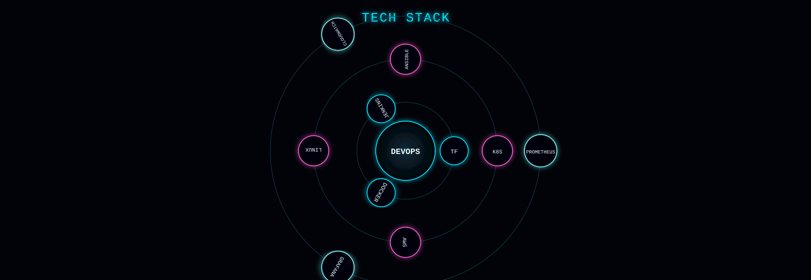

<div align="center">



</div>

<br/>

<div align="center">

</div>

## 🧭 `whoami`

```
> DevOps Engineer focused on automation, CI/CD, and cloud-native infrastructure
> 3.5+ years building pipelines, containerized systems & self-healing deployments
> 1 year hands-on Linux system administration
> Infrastructure as Code with Terraform — because clicking around consoles doesn't scale
> Observability wired in from day one: Prometheus + Grafana + CloudWatch
```

<br/>

<div align="center">

</div>

<div align="center">

</div>

## 📡 `connect --remote`

<div align="center">

[](https://linkedin.com/)
[](https://github.com/msdinesh98)
[](mailto:)

</div>

<br/>

<div align="center">

</div>
